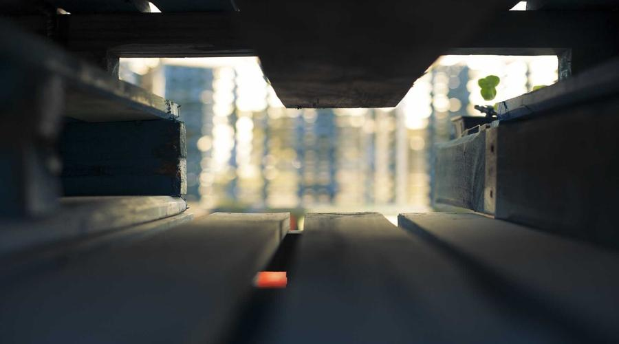
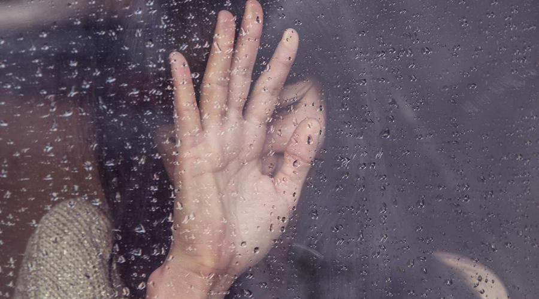
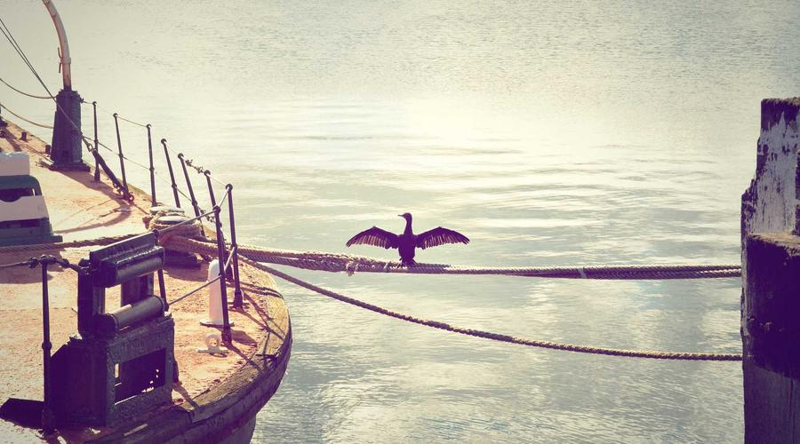

前几天，在小区里看到一个的场景：

一个三四岁的小孩正在努力地自己系鞋带，动作很笨拙，半天也没系好。一旁的妈妈看不下去，直接蹲下来，两三下就帮他系好了。

小孩愣了一下，然后继续玩别的去了。

但我看到的是：那个妈妈眼神里有一丝犹豫——她不确定自己做得对不对。

其实不只是她，我相信很多父母都有过类似的纠结：

> 到底是该帮孩子做，还是该让他自己来？
> 到底该严格要求，还是该宽松对待？
> 到底该听专家的，还是该凭本能？

今天想聊聊我当了父亲之后的真实感悟。可能不专业，但都是心里话。

---

## 01 那些我们曾经坚信的教育方式

说实话，在有孩子之前，我对家庭教育这事是有点自信的。

为什么？因为我爸妈把我养大了，我学习还行，工作也还算顺利。所以潜意识里觉得：教育嘛，不就是那么回事？

但当我真正开始带孩子，才发现——我错了。

举个例子。

我爸妈那一代的育儿理念，总结起来就四个字：**「听话就行」**。

小时候，我只要照着他们说的做，就没问题。顶嘴？那是不存在的。考试成绩不好，挨一顿骂是正常的。选专业？爸妈决定的。找工作？爸妈托关系的。

不是说我爸妈不爱我——他们把所有最好的都给了我。但这种教育方式，印在我骨子里的影响是：

**我不太会自己做决定。**

工作了之后，我发现自己在职场里总是畏手畏脚，害怕做选择，担心选错了会被批评。开会时明明有想法，却不敢说出来。遇到问题，第一反应是"请示领导"，而不是"自己想办法"。

后来我才慢慢意识到：这不是能力问题，是教育方式的问题。

---

## 02 时代变了，但很多父母还没变

但你发现没有，很多父母还在用上一代的方式教育这一代的孩子。

不是说老一辈的方法完全不对——毕竟我们也长大了。但时代确实变了。

我们那个年代，信息封闭，社会简单，「听话」确实是一种生存策略。但现在的孩子，从小就接触海量信息，面临的竞争和选择比我们那时候复杂一百倍。

你再跟孩子说"听话就行"，他听了谁的话？网上那么多声音，他该听谁的？

我自己也差点犯了这个错误。

有一次，孩子因为一道数学题做不出来，急得哭鼻子。我第一反应是：**"这有什么好哭的？不就是一道题吗？"**

但后来我冷静下来一想——不对啊，我在他这个年纪，面对一道不会做的题，可能还不如他呢。

我在用我成年人的标准，去衡量一个几岁孩子的能力。这公平吗？

---

## 03 最好的教育，是让孩子「自己来」

说个我自己受益终身的改变。

以前孩子玩玩具，我总是忍不住帮他整理。不是因为他整理不好，是我嫌他慢、嫌他弄不好。但后来我强迫自己：就算他整理得像狗窝，也让他自己来。

结果呢？

一开始确实很慢，很乱。但慢慢地，他开始有自己的收纳逻辑了。有时候我帮他收拾，他还跟我说："爸爸，你放得不对，我这个是要放这里的。"

我突然意识到：**让孩子自己来，不是偷懒，是给他成长的机会。**

很多父母（包括以前的我）觉得，为孩子做得越多，就是越爱他。但其实做得越多，可能是剥夺了他学习的机会。

就好比学游泳，你一直扶着他，他永远学不会。你松手，他才能自己扑腾。

教育也是一样的道理。

---

## 04 接纳孩子的情绪，比纠正行为更重要

但话说回来，让孩子「自己来」，不等于完全放任不管。

我学到的另一个重要课题是：**接纳孩子的情绪，比纠正他的行为更重要。**

还是说回前面那个例子。孩子因为做不出题哭了。以前的我可能会说："不许哭，这有什么大不了的。"

但现在的我会先抱抱他，跟他说："这道题确实有点难，做不出来很挫败对不对？爸爸理解你的心情。"

神奇的是，当他发现我可以理解他的情绪，他反而很快就平静下来了。然后我们再一起想办法解决那道题。

你知道为什么吗？

因为**被理解，是建立安全感的第一步。**

一个孩子如果从小情绪不被理解，他要么变得极度压抑，要么变得极度叛逆。哪种都不是我们想要的。

所以我现在养成了一个习惯：孩子有情绪的时候，先接纳，再引导。

> "我知道你不开心，但我们能不能一起想想怎么解决？"

这句话比我以前说的任何道理都管用。

---

## 05 父母也是第一次当父母

但我也想替我们自己说句话。

父母也是第一次当父母，我们也是在摸索中成长的。

我记得孩子刚出生的时候，我特别焦虑。看各种育儿书，听各种专家课，生怕自己哪里做错了，耽误了孩子的一生。

但后来我想明白了：**没有完美的父母，也没有完美的教育。**

你严厉了，有人说你压迫孩子。你宽松了，有人说你溺爱孩子。你关注成绩，有人说你鸡娃。你不管成绩，有人说你不负责。

怎么着都不对。

但我想说的是：养孩子不是做实验，没有对照组。你没办法知道如果当初换一种方式，孩子会不会更好。

我们能做的，就是**在每一次互动中，尽可能地尊重孩子、相信孩子、也相信自己。**

偶尔情绪失控，偶尔做得不够好，没关系的。重要的是，我们愿意学习和反思。

这本身就是一种教育。

---

## 06 教育的终极目标，是让孩子成为自己

最后想说说我对教育的终极理解。

我不知道别的父母怎么想，但我养孩子的目标，从来不是让他变成"别人家的孩子"。

我希望的很简单：**他可以成为他自己。**

有自己的想法，敢于表达，也能承受后果。有自己的爱好，能享受独处，也能融入群体。遇到问题会害怕，但也会想办法。不需要多成功，但需要知道自己想要什么。

说白了，我希望他**独立而自信。**

而要培养这样的孩子，核心就一点：**少替他做，多让他想。**

系鞋带慢，就让他慢慢系。题目做不出来，就陪他一起想。遇到困难，先问他想怎么办，而不是直接给他答案。

给他时间，给他空间，给他信任。

剩下的，他自己会来。

---

## 划重点

说到底，家庭教育就三句话：

[金句1]：不是为孩子做越多越好，而是让他自己做越多越好
[金句2]：接纳情绪比纠正行为更重要
[金句3]：教育的终极目标，是让孩子成为自己

你呢？

你在家庭教育中，最困惑的是什么？有没有哪一刻，你觉得自己做得特别好，或者特别糟糕？
欢迎留言聊聊，**我真的很想知道你的故事**。

---

**参考来源**：

- [中国青少年研究中心：家庭教育现状调查报告](https://www.cycs.org/)
- [发展心理学：儿童情绪能力培养指南](https://www.apa.org/)
- [正面管教：用尊重与鼓励养育孩子](https://www.positivediscipline.org/)

*本文参考资料均来自公开渠道，观点仅供参考。*
