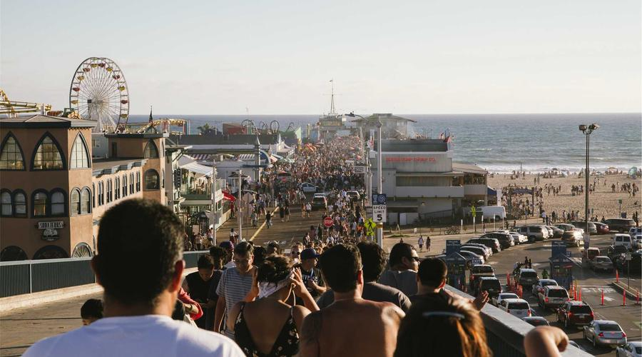
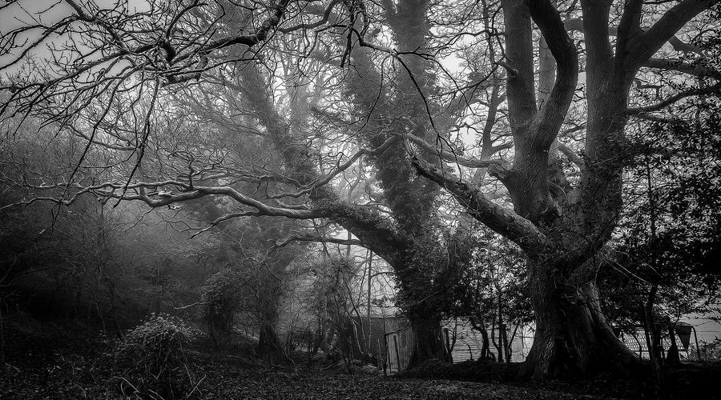
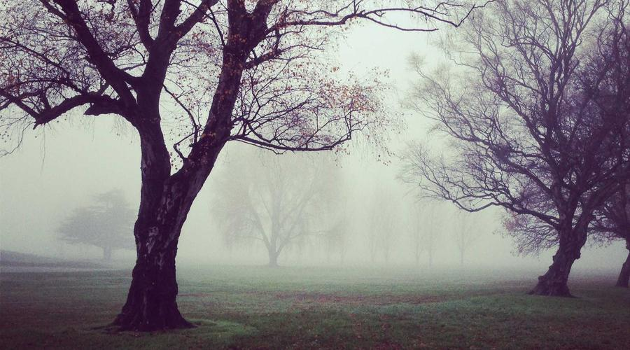

你有没有这种感觉？

每天上班、下班、加班，周而复始。偶尔抬头看天，才发现春天已经过去了。

我们的生活，好像被按下了快进键，却又好像什么都没变。

但有时候，一次旅行，能让一切都不一样。

## 01 第一次真正意义上的旅行

说出来有点好笑，我第一次认真去旅行，是在工作第5年。

之前不是没有出去玩过，但都是"周边游"、"周末两天一夜"，攻略没做几点，酒店就订个经济型的，到了地方拍几张照片，发个朋友圈，证明"我来过"。

说白了，那不叫旅行，那叫"换个地方玩手机"。

直到那次，我辞掉了那份让我焦虑的工作，一个人去了云南。

没有详细的计划，没有必须打卡的景点我就是想走走。

## 02 在大理，我学会了"慢"

到了大理，我没有急着去逛景点。

第一天，我就坐在洱海边，发了一整天呆。

说真的，一开始我特别不习惯。作为一个习惯了"高效"的职场人，"什么都不做"让我浑身难受。我甚至觉得，这是不是就是在浪费时间？

但慢慢我发现，当你不再赶时间的时候，世界会变得不一样。

海风吹过来的时候，你会注意到它的温度。阳光照在水面上的波纹，你会看到它在跳舞。远处苍山的轮廓，你会看清它和云彩的关系。

这些细节，在城市里我从来没有注意过。

因为在城市里，我的注意力永远在"下一步"：下一份工作、下一个项目、下一个目标。

## 03 旅行改变的，是看待世界的眼光

从云南回来之后，我发现自己变了。

不是那种"打鸡血"式的改变，而是更深层次的，一些微妙但很重要的变化。

比如说，我现在会注意到生活中很多以前视而不见的东西。

早上上班路上，樱花开了。傍晚回家的天空，是粉红色的。这些事情以前也存在，但我从来没有看见。

再比如说，我开始愿意"浪费时间"了。

以前的我，做任何事情都要问"这有什么用？"现在的我，会允许自己做一些"没用"的事：发发呆、散散步、或者就是坐着什么也不想。

不是因为这样做有什么收益，而是因为，我开始相信：有时候，过程本身就是意义。

## 04 旅行让人重新认识自己

很多人说，旅行是最好的修行。

我以前觉得这是鸡汤，但亲身体验之后，我发现它是有道理的。

在旅行中，你会被迫面对一些问题：迷路了怎么办？找不到路怎么办？遇到突发情况怎么解决？

这些问题，在日常生活中往往被"惯性"解决了。你知道回家的路，你知道怎么点外卖，你知道遇到问题找谁。

但在陌生的地方，一切都重新变得不确定。

而正是这种不确定，让你不得不认识真正的自己。

你会发现，原来你没有想象中那么脆弱。原来你有能力处理突发情况。原来你比自己以为的更勇敢。

## 05 旅行不是万能的，但它是必要的

说了这么多旅行的好处，我得泼点冷水。

旅行不是万能的，不是去了趟西藏回来就"净化心灵"了，也不是去了趟大理就能找到人生方向了。

大部分时候，旅行只是旅行。

它不能帮你解决工作中的问题，不能让你的银行卡余额变多，也不能让你的人生瞬间开挂。

但它有一个被很多人忽视的作用：它能让你从"现在的生活"中暂时抽离出来，用一个旁观者的角度，看看自己到底在过什么样的日子。

有时候，我们需要的不是更多的努力，而是停下来，想一想。

## 06 旅行的意义，在于"出发"本身

最后我想说的是，关于旅行，很多人把它想得太复杂了。

要存够钱，要有假期，要做好详细的攻略，要拍出好看的照片，要发完美的朋友圈

但其实，旅行最珍贵的部分，往往是最简单的：出发。

你不需要等到"准备好"的那一天，不需要等到"最有意义"的时机。

有时候，最美的风景，不在目的地，而在路上。

而那个愿意出发的你，才是旅行带给你最好的礼物。

---

## 划重点

说到底，这篇文章讲的就是三句话：

旅行不一定能改变你的人生，但一定能改变你看生活的眼光。

慢下来不是浪费时间，而是重新找回对生活的感知。

出发本身就是意义，不需要等到"准备好"的那一天。

## 你呢？

有没有哪次旅行让你印象特别深刻？

或者，你有多久没有出发了？

欢迎留言聊聊，**我真的很想听听你的故事**。

---

**参考来源**：

- [中国旅游研究院：2023中国旅游经济蓝皮书](https://www.cta.org.cn/)
- [携程：2024年旅游趋势报告](https://www.ctrip.com/)
- [马蜂窝：年轻人旅行方式研究报告](https://www.mafengwo.cn/)

*本文参考资料均来自公开渠道，观点仅供参考。*
